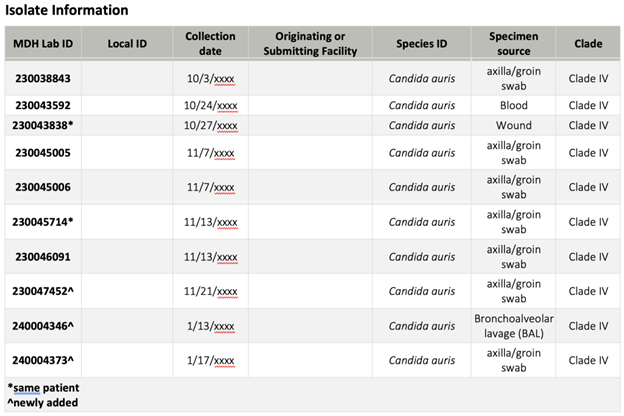

# **{{ page.title }}**
- **Analysis:** Table of Isolates and Identified Species
- **Pathogen or pathogen types:** any
- **Data required:** collection date, species, lineage (optional)
- **Sent in by:** Beth Thielen
- **Subject matter experts:** Jennifer Dale, MDH (Minnesota)
- **Potential pitfalls:** 
- **Purpose of analysis (why):**

