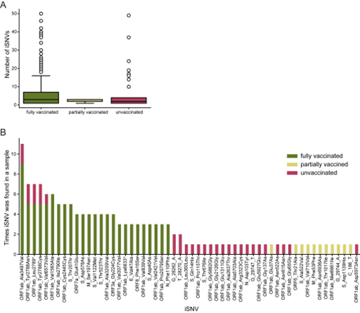

# **{{ page.title }}**

Analysis: Within-host mutations by vaccination status
Pathogen or pathogen types: any
Data required: sequences, vaccination status
Sent in by: Lydia Krasilnikova
Subject matter experts: ____
Potential pitfalls: 
Purpose of analysis (why): If vaccination is associated with increased within-host diversity, it may indicate vaccine escape. If vaccination is associated with decreased within-host diversity, it may indicate that vaccination is enhancing immune response, reducing pathogen population size and diversity.
Notes:
-	Example from https://doi.org/10.1016/j.cell.2021.12.027

