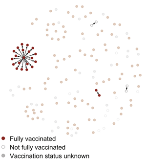
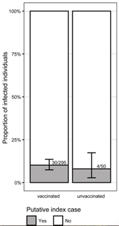

# **{{ page.title }}**

Analysis: Transmission reconstruction with demographics including vaccination status
Is there age structure? (might need to close elementary schools, etc.)
Pathogen or pathogen types: any
Data required: sequences or contact tracing, vaccination data or other risk factor data
Sent in by: Lydia Krasilnikova
Subject matter experts: ____
Potential pitfalls: 
Purpose of analysis (why): 
Notes:
-	If sequences provided, requires transmission reconstruction software (e.g., JUNIPER, BadTrIP, TransPhylo, outbreaker2)
-	epitrace package has good visualizations
-	collate the tools that do this and their pros and cons
-	Example from https://doi.org/10.1016/j.cell.2021.12.027

