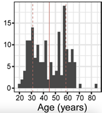
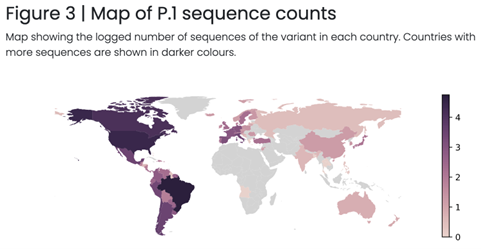
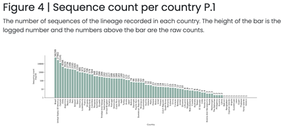
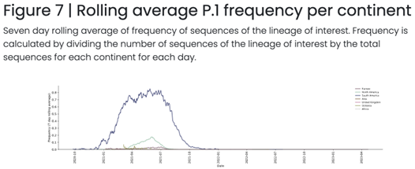

# **{{ page.title }}**

Analysis: Patient Demographics of Detected and Sequenced Cases
Pathogen or pathogen types: any
Data required: which patients were sequenced, patient demographics, e.g., age, gender, race, ethnicity, vaccination status, geographic location, travel history, lineage or pathogen counts, collection date, geographic location
Sent in by: Lydia Krasilnikova
Subject matter experts: Áine O'Toole, Emily Scher, and Andrew Rambaut
Notes:
- Can be lineage, can be pathogen in general
- Example from cov-lineages.org
Potential pitfalls: data cleaning
Purpose of analysis (why): estimate the representativeness of sampling, identify at-risk groups

