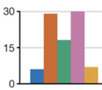
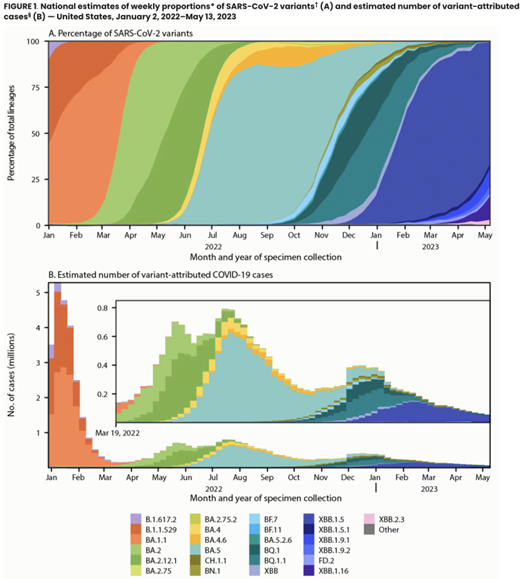
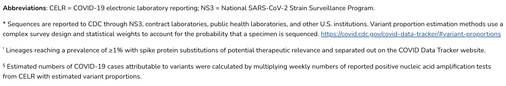
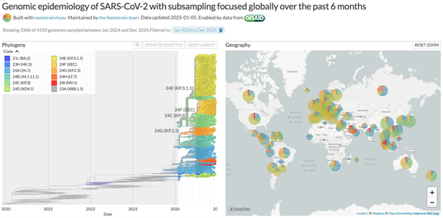
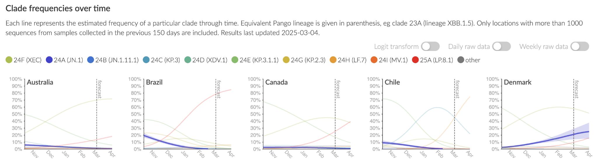
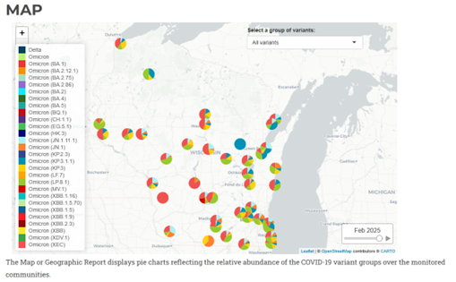
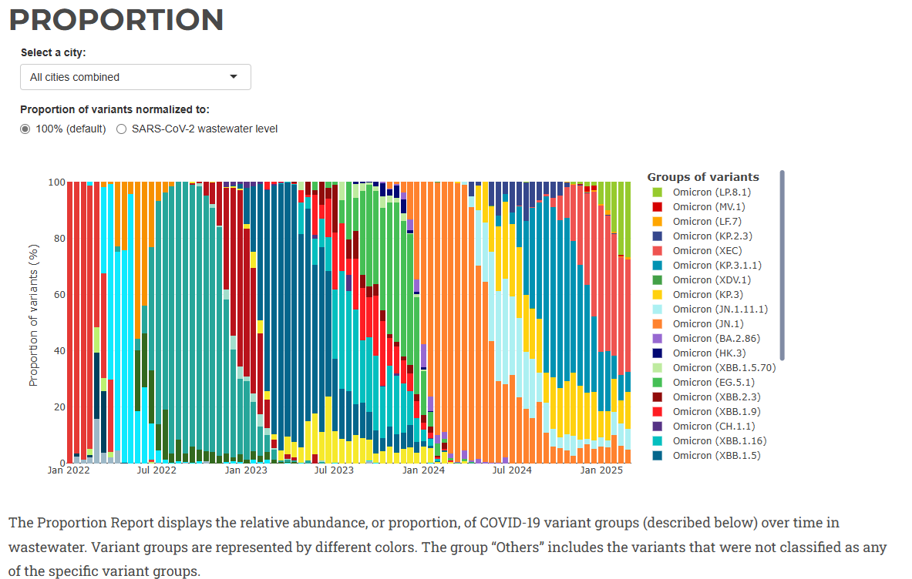

# **{{ page.title }}**

Analysis: Lineage Proportions
Pathogen or pathogen types: viral
Data required: whichever available of lineage, collection date, sequence
Sent in by: Lydia Krasilnikova, Kim Andrews
Subject matter experts: the Nextstrain team
Potential pitfalls: 
Purpose of analysis (why): 
Notes:
-	Example from https://www.cdc.gov/mmwr/volumes/72/wr/mm7224a2.htm
-	Example: https://nextstrain.org/ncov
-	Example - forecasts: https://nextstrain.org/sars-cov-2/forecasts
-	Example - Wastewater: https://dataportal.slh.wisc.edu/sc2-ww-dashboard
-	Example - Wastewater:https://coronavirus.health.ny.gov/covid-19-wastewater-variant-data

## 3a. What lineages dominate overall?
Analysis: Lineage proportions
Data required: lineage

## 3b. What lineages dominate over time?
Analysis: Lineage proportions over time
Data required: lineage, collection date

## 3c. What lineages dominate in different locations?
Analysis: Lineage proportions on a geographic map and alongside a phylogenetic tree
Data required: lineage, geographic location, sequence

## 3d. What lineages do we predict will dominate in the future?
Analysis: Multinomial Logistic Regression
Data required: lineage, sequence, collection dates, geographic location, a lineage nomenclature system that takes into account putative adaptive variation
Notes:
-	Example from https://nextstrain.org/sars-cov-2/forecasts
-	Software: https://github.com/blab/evofr
-	Relevant papers: Methods description and SARS-Cov2 example

# 3e. What lineages dominate wastewater surveillance?
Analysis: Lineage proportions
Data required: lineage classification, wastewater sequencing data

# 3f. What lineages dominate wastewater over time?
Analysis: Lineage proportions over time
Data required: lineage classification, collection date,

