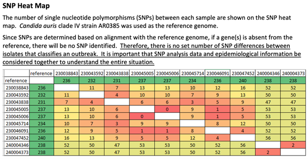
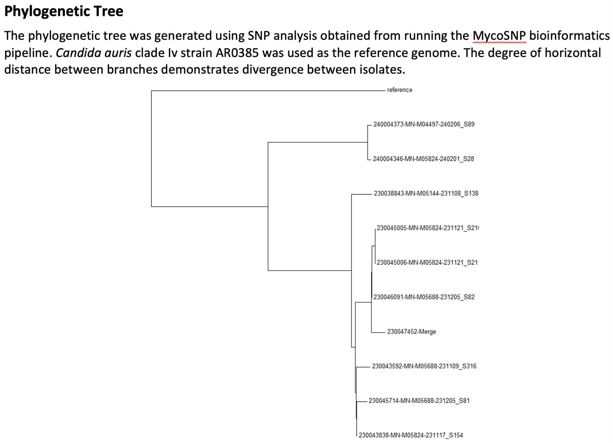

# **{{ page.title }}**

Pathogen or pathogen types: any
Data required: sequence
Sent in by: Beth Thielen
Subject matter experts: Jennifer Dale, MDH (Minnesota); Dan Evans, MDH (Minnesota)
Potential pitfalls: 
Purpose of analysis (why): 
Notes:
-	Requires pre-selected reference (what reference to use for each possible pathogen? RefSeq?)
-	Not always - but the methods can certainly affect the outcome (reference-based, reference-free, whole-genome, core-genome, etc.)
-	Describe distinct clusters identified and with what thresholds (what thresholds to set for each pathogen type?)
-	Must include sequencing methods as an appendix

