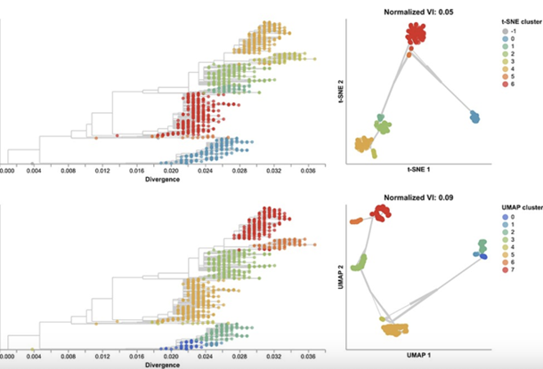
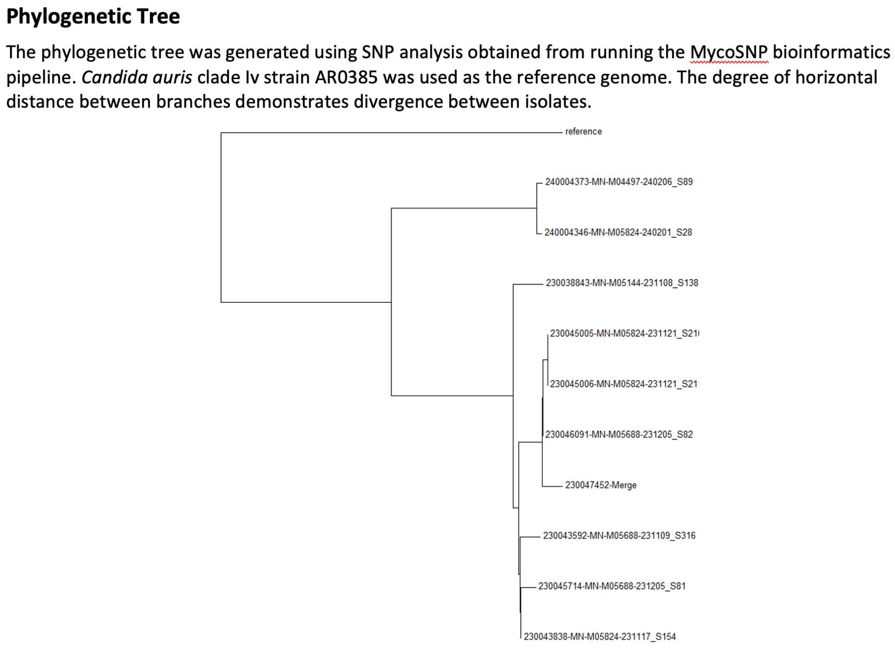
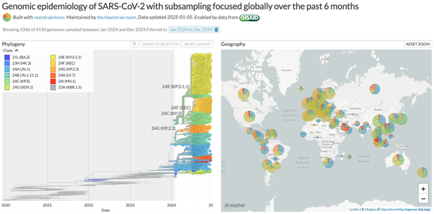

# **{{ page.title }}**

Analysis: Dimensionality reduction methods to identify clusters of related sequences and identify reassortment (e.g., PCA, MDS, t-SNE, UMAP)
Pathogen or pathogen types: viruses, potentially bacteria (more complicated)
Data required: sequences
Sent in by: Kim Andrews
Subject matter experts: Sravani Nanduri, Allison Black, Trevor Bedford, John Huddleston
Potential pitfalls: 
Purpose of analysis (why): 
Notes:
-	Clustering methods are alternatives to phylogenetic analysis
-	Useful for:
-	Fast analysis (faster/simpler than phylogenetic analysis)
-	Pathogens that lack existing clade definitions
-	Pathogens with too much recombination to be analyzed with standard phylogenetic methods
-	Tools with phylogenetic reconstruction for when number of sequences is large
-	Figure showing that dimensionality reduction methods identify similar clusters as do phylogenetic analyses for influenza H3N2 HA sequences from https://academic.oup.com/ve/article/10/1/veae087/7900085?login=false

Phylogeny with contextual genomes from publicly available data or other sources.
Phylogenetic placement on Nextstrain or Nextclade trees.

