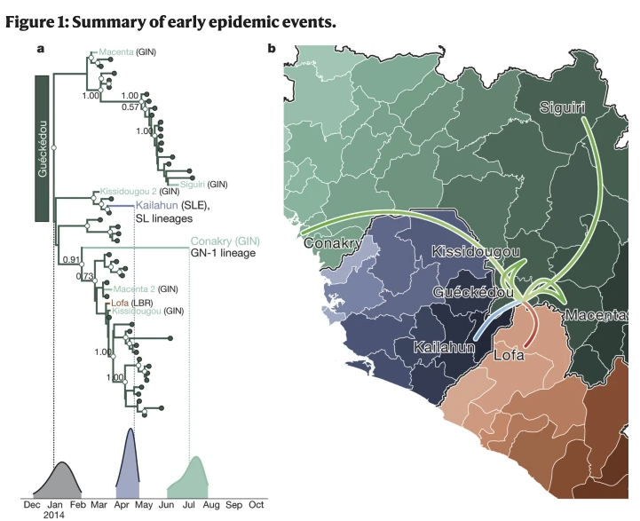
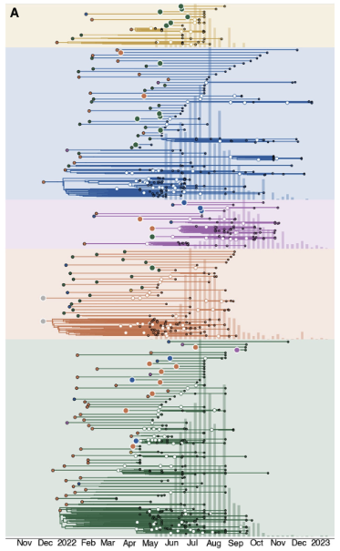

# **{{ page.title }}**

Analysis: Phylodynamic analysis
Pathogen or pathogen types: all pathogens, but viruses more easily
Data required: sequence data with sample dates and location
Sent in by: JT McCrone
Subject matter experts: Andrew Rambaut, Trevor Bedford (and lab), Gytis Dudas, JT
Potential pitfalls:
-	Requires sampling through time or a predetermined evolutionary rate
Purpose: 
-	Has the pathogen been circulating undetected?
-	Where did the outbreak begin?
-	When did the pathogen arrive in a given location?
-	Do cases in a region represent one or multiple transmission chains?
-	How quickly is the outbreak growing?

Notes:
-	We can use dated sequences to estimate the timing of the most recent common ancestor of the cases which approximates the start of the outbreak 
-	We can combine this with location data data to estimate the number and timing of introductions into regions of interest.
Resources:
-	https://beast.community/
-	https://nextstrain.org/

Examples:
https://www.nature.com/articles/nature22040

https://www.cell.com/cell/pdf/S0092-8674(24)00124-7.pdf

