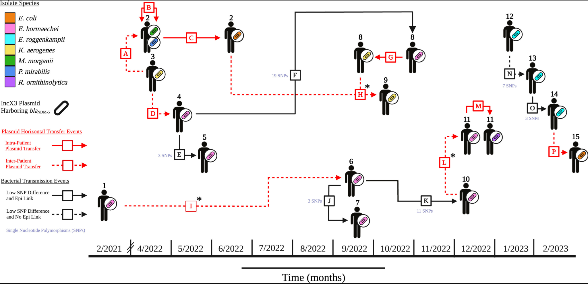

# **{{ page.title }}**

Analysis: Plasmid tracking
Pathogen or pathogen types: bacterial
Data required: bacterial isolate assemblies, preferably long read or hybrid sequencing but short read data is fine
Sent in by: Colin Worby
Subject matter experts: Anita Schurch, Daria van Tyne, Ashlee Earl
Potential pitfalls: 
Purpose of analysis (why): 
Notes:
-	Important virulence/resistance phenotypes often conferred by plasmid-borne genes; tracking strains (chromosomal similarity) is insufficient to characterize dissemination of such units across strains, species and genera. Tools like Gplas2, MOBSuite can characterize plasmids from assemblies, further comparison of plasmids (or mobile elements within plasmids) can be performed to assess transmission.

https://www.ijidonline.com/article/S1201-9712%2824%2900041-9/fulltext