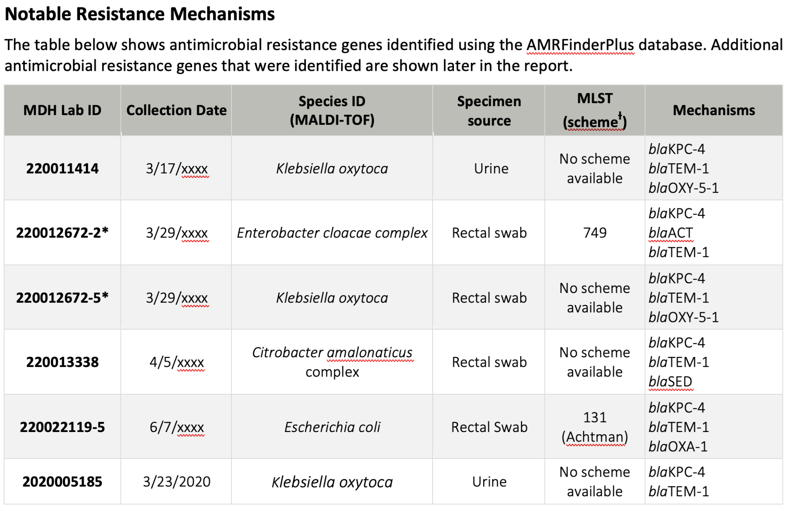
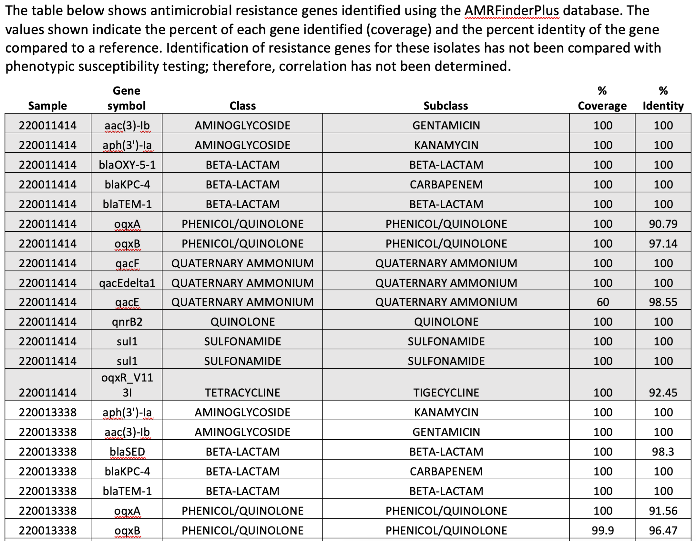

# **{{ page.title }}**

Analysis: Antimicrobial Resistance Genes
Pathogen or pathogen types: bacterial
Sent in by: Beth Thielen
Data required: sequence
Subject matter experts: Jennifer Dale, MDH (Minnesota)
Potential pitfalls: 
Purpose of analysis (why): 
Notes:
-	Must include sequencing methods as an appendix

