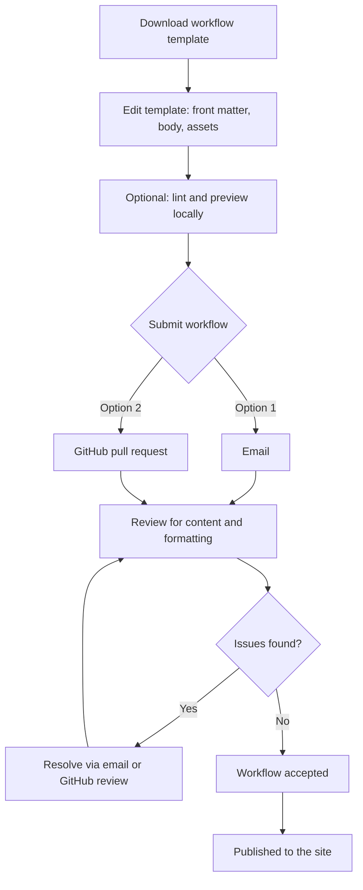

# {{page.title}}
{: .no_toc }

## Table of contents
{: .no_toc .text-delta }

1. TOC
{:toc}

## Overview

This page describes the process for creating and submitting a workflow using
the workflow template. Additional resources related to Markdown formatting can
be found on the previous page.

---

## Submission Process

Creating, submitting, and publishing a workflow involves three main phases:

1. **Create a new workflow** from the provided template — download it, fill it
   out, and add any supporting files.
2. **Submit your workflow** for review — either by email or through GitHub.
3. **Review and publication** — your workflow is reviewed for content and
   formatting, any issues are resolved, and the accepted workflow is published
   to the site.

The full process is shown below, and each phase is described in detail in the
sections that follow.



---

## Creating a New Workflow

A workflow is built from the **workflow template**, a small directory that
contains everything you need to get started:

| File / Folder | Purpose |
|---------------|---------|
| `template.md` | The workflow page itself — front matter plus the body content readers will see. |
| `search_terms.yml` | A curated list of category terms (organism, application, etc.) to choose from when filling out the front matter. |
| `assets/` | An initially empty directory for the downloadable files your workflow provides — inputs, step outputs, and sample data. |

### Downloading the workflow template

Download the workflow template as a zipped directory using the link below, then
unzip it into a new folder named for your workflow.

<a href="assets/workflow_template.v1.zip" download>⬇ Download the workflow template</a>

After unzipping, you should have:

```
your-workflow/
├── template.md
├── search_terms.yml
└── assets/
```

### Editing the workflow template

We recommend editing `template.md` in an editor with Markdown support and live
preview, such as [Visual Studio Code](https://code.visualstudio.com/) (free
desktop editor; open the preview pane with `Ctrl+Shift+V` /
`Cmd+Shift+V`), [HackMD](https://hackmd.io/) (free browser-based Markdown
editor — no installation required, with side-by-side preview as you type),
or by rendering the site locally (see [Advanced users](#advanced-users) section).

Open `template.md` and work through it top to bottom:

1. **Fill out the front matter.** Complete every field following the inline
   comments. Choose `category` values from the curated list in
   `search_terms.yml`, and see the previous page for a detailed description of
   each field.
2. **Write the body.** Replace every `[bracketed placeholder]` with your own
   content, delete any optional sections or callouts you don't need, and remove
   the instructional `<!-- HTML comments -->` once you no longer need them.
3. **Add your files to `assets/`.** Place any downloadable inputs, step
   outputs, or sample data in the `assets/` directory and link to them with
   relative paths (e.g., `assets/step1_output.ext`). Each file must stay within
   GitHub's upload limits — 25 MB per file via the web interface, 100 MB hard
   cap. For anything larger, link to an external source (e.g., NCBI) instead.
   Note: These will not render if using HackMD.

---

## Submitting a Workflow

Once your workflow is complete — front matter filled out, body content written,
placeholders removed, and supporting files added to `assets/` — submit it using
one of the two options below.

### Option 1 - Submit via email

Compress your completed workflow directory (your edited `template.md`,
`search_terms.yml`, and the `assets/` folder) into a single `.zip` file and
email it to [submission email address].

Include [any required details, e.g., your name, affiliation, and a short
description of the workflow] in the body of the email.

### Option 2 - Submit via GitHub

If you're comfortable with Git, you can submit your workflow as a pull request:

1. Fork the [website repository](https://github.com/doh-jdj0303/pgcoe-sc6-test-site).
2. Add your workflow directory to `pgcoe-sc6-test-site/_workflows/`.
3. Commit your changes and open a pull request describing your workflow.

A maintainer will review your submission and request changes if needed.

--- 

## Review Process

After submission, your workflow is reviewed for overall content and formatting.
Any issues identified during review are resolved through follow-up
correspondence — by email for email submissions, or through the GitHub review
process (review comments on your pull request) for GitHub submissions. Review
may take a few rounds until the content and formatting are in order.

Once the workflow is accepted, it is published to the site.

---

## Advanced users

The following steps are optional but recommended. They let you catch formatting
issues and preview your workflow exactly as it will appear before submitting.

### Adding your workflow to the site repo

Clone the site repository and copy your workflow directory into the workflows
directory:

```bash
# Clone the site repository (first time only)
git clone https://github.com/doh-jdj0303/pgcoe-sc6-test-site.git
cd pgcoe-sc6-test-site/

# Copy your workflow into the workflows directory
cp -r path/to/your/workflow _workflows/
```

### Formatting the workflow

Running the formatting script validates your front matter and prepares the
workflow for rendering, both locally and via GitHub Pages. It checks that all
required fields (`title`, `date`, `category`, `author`, and `synopsis`) are
present, verifies the date is in `YYYY-MM-DD` format, and adds the layout
fields and page includes needed for the site to render your workflow.

```bash
# Install the dependency (first time only)
pip install python-frontmatter

# Format and validate your workflow
python helpers/format_submission.py _workflows/your-workflow/
```

The script reports any missing or malformed fields and exits without modifying
your files if validation fails. Fix the reported issues and run it again.

### Rendering the workflow locally

To preview the workflow exactly as it will appear on the site, build the
Jekyll site from the repo root:

```bash
# Install dependencies (first time only)
bundle install

# Build and serve the site
bundle exec jekyll serve
```

Then open <http://localhost:4000> in your browser and navigate to your page
under the workflows section. The site rebuilds automatically as you save
changes, so you can edit the file in `_workflows/your-workflow/` and refresh
to see updates.
---

## Additional Resources
- [Markdown formatting](markdown_formatting/)
- [Jekyll documentation](https://jekyllrb.com/docs/) — for building and serving
  the site locally.